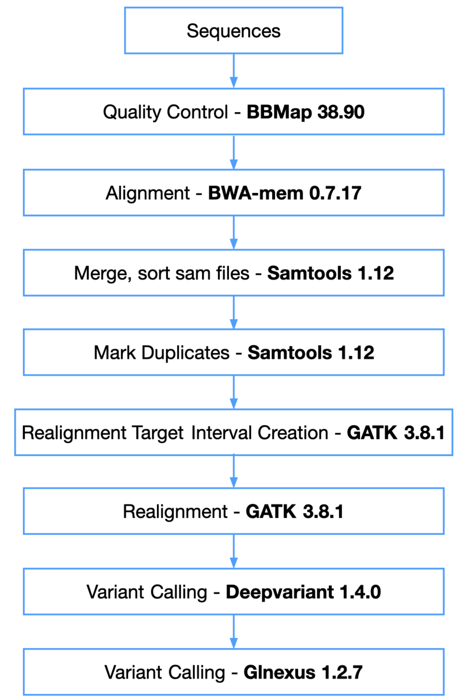

# [Palmer Lab](https://palmerlab.org/) :test_tube: High Coverage WGS DeepVariant Genotyping Pipeline 

## Overview
This github repository is to document Palmer Lab's High Coverage WGS DeepVariant Genotyping Pipeline. We are also part of [NIDA center for genetic studies of drug abuse in outbred rats](https://ratgenes.org).

## Contents
- **[genotyping](genotyping)**: This folder contains the complete pipeline code that utilizes HPC's different schedulers' array jobs feature to achieve parallelization.  
- **[submission_TSCC_PBS.sh](submission_TSCC_PBS.sh)**: This an example of how to submit the pipeline to PBS HPC system.  

## Pipeline Overview

